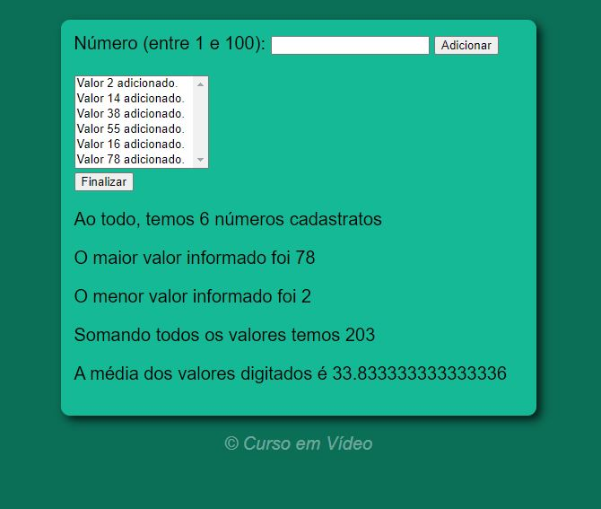

# Página que adiciona os números digitados e retorna informações sobre a sequência digitada

## Página que adiciona os números digitados e retorna informações sobre a sequência digitada ao clicar em finalizar   Feito com HTML, CSS e JavaScript.  Projeto realizado com o professor Gustavo Guanabara do Curso em Vídeo.👩🏽‍💻

### [👉🏽 Clique aqui para acessar a página](https://letsle.github.io/contador/) 

